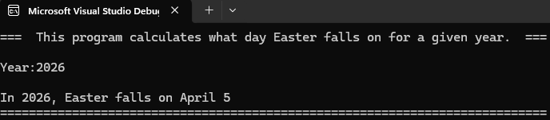

# 🐣 Easter Date Calculator (C#)


A C# console application that calculates the date of **Easter Sunday** for any given year using the *Anonymous Gregorian Computus algorithm*.

---

## 📸 Example Output




---

## 📌 Features

* 📅 Calculates Easter for any Gregorian year
* 🧮 Implements a well-known mathematical algorithm
* 🖥️ Clean console-based user interaction
* 🧱 Demonstrates core C# fundamentals:

  * Input parsing
  * Arithmetic logic
  * `DateTime` formatting

---

## 🧠 Algorithm Overview

This program uses the **Anonymous Gregorian Computus**, which determines Easter based on:

* The lunar cycle (Metonic cycle)
* The solar calendar
* Modular arithmetic and integer division

---

## ▶️ Getting Started

### Prerequisites

* .NET SDK installed
* Visual Studio or compatible IDE

### Run the App

```bash
dotnet build
dotnet run
```

Or in Visual Studio:

* Open the `.sln` file
* Press `F5` to run

---

## 💻 Example Run

```text
===  This program calculates what day Easter falls on for a given year.  ===

Year:2026

In 2026, Easter falls on April 5
============================================================================
```

---

## 📁 Project Structure

```text
EasterCalculator/
│
├── EasterCalculator.sln
├── EasterCalculator/
│   ├── Program.cs
│   ├── EasterCalculator.csproj
│
├── images/
│   └── easter-output.png
```

---

## ⚠️ Limitations

* Assumes valid numeric input
* No input validation implemented
* Only valid for Gregorian calendar years (1583+)

---

## 🚀 Future Improvements

* [ ] Add input validation
* [ ] Loop for multiple calculations
* [ ] Convert to GUI (WinForms or WPF)
* [ ] Add unit testing
* [ ] Refactor into methods / OOP structure

---

## 🔗 Repository

https://github.com/Austin-J-Phillips/EasterCalculator

---

## 📜 License

This project is open-source and available for educational use.

---

## 👤 Author

Austin Phillips
C# Developer (Learning & Building Projects)
